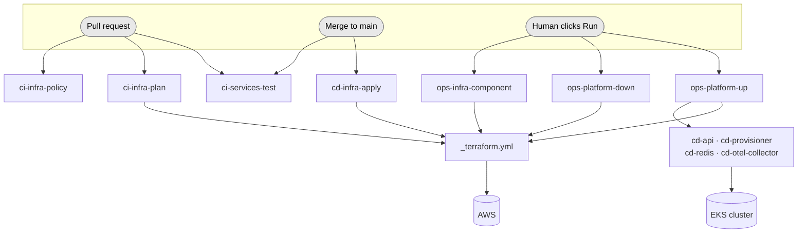

# CI/CD Pipelines

Every automated process in this repository lives here. This page is the map:
what runs, when, with what permissions, and what it can break.

## How to read the filenames

Workflow files cannot be nested — GitHub only reads `.github/workflows/*.yml`
at the top level — so the tier is encoded in the filename prefix instead.

| Prefix | Meaning |
| --- | --- |
| `ci-` | Runs automatically on **pull requests**. These are the merge gates. |
| `cd-` | **Ships something.** Fires on merge to `main`, or is called by an `ops-` workflow. |
| `ops-` | **Manual only.** A human presses "Run workflow". |
| `_` | **Internal library.** Called by other workflows via `workflow_call`; never runs on its own. |

## The workflows

### Merge gates (automatic, read-only)

| Workflow | Fires on | What it does |
| --- | --- | --- |
| [`ci-services-test.yml`](ci-services-test.yml) | PR touching `services/**` | Builds, vets, format-checks and tests both Go services. |
| [`ci-infra-plan.yml`](ci-infra-plan.yml) | PR touching `infra/**` | Runs `terraform plan` per affected component and posts each plan as a PR comment. |
| [`ci-infra-policy.yml`](ci-infra-policy.yml) | PR touching `infra/**` | Repo-wide `terraform fmt` check (blocking), plus a Checkov security scan and an Infracost cost diff (both advisory — see below). |

### Deployments (automatic or orchestrated, mutating)

| Workflow | Fires on | What it does |
| --- | --- | --- |
| [`cd-infra-apply.yml`](cd-infra-apply.yml) | push to `main` touching `infra/**` | Re-plans and applies affected components. **Waits for approval.** |
| [`cd-api.yml`](cd-api.yml) | manual / orchestrated | Builds the API image → ECR → rolling update on EKS. |
| [`cd-provisioner.yml`](cd-provisioner.yml) | manual / orchestrated | Same, for the SQS consumer. |
| [`cd-redis.yml`](cd-redis.yml) | manual / orchestrated | Applies the in-cluster Redis manifests. |
| [`cd-otel-collector.yml`](cd-otel-collector.yml) | manual / orchestrated | Applies the OTel Collector manifests and forces a restart. |

### Operator entry points (manual)

| Workflow | What it does |
| --- | --- |
| [`ops-platform-up.yml`](ops-platform-up.yml) | Creates the **entire platform** from nothing, in dependency order. |
| [`ops-platform-down.yml`](ops-platform-down.yml) | Destroys the **entire platform**. Requires typing `destroy` to confirm. |
| [`ops-infra-component.yml`](ops-infra-component.yml) | Plan/apply/destroy **one** component. For targeted work. |

### Internal

| Workflow | What it does |
| --- | --- |
| [`_terraform.yml`](_terraform.yml) | The single Terraform pipeline every component runs through. All component-specific knowledge lives here. |

## How it fits together

## Approvals: the `dev` and `dev-auto` environments

Every `terraform apply` and `terraform destroy` runs inside a GitHub deployment
environment:

- **`dev`** — has a required-reviewer rule. The job pauses and a human approves
  it with the plan visible in the run log. This is the default.
- **`dev-auto`** — identical, but with no protection rules.

Neither environment holds secrets or variables of its own, so the reviewer rule
is the only difference between them, and the deployment is recorded either way.

## Repository variables

Two variables control how much runs unattended. Both are ordinary repository
variables (Settings → Secrets and variables → Actions → Variables).

| Variable | Effect when `true` |
| --- | --- |
| `DISABLE_DEPLOYMENT_APPROVALS` | Terraform apply/destroy use `dev-auto` instead of `dev`, so nothing pauses for approval. |
| `DISABLE_BRANCH_TRIGGERS` | The PR and push-to-main infra workflows skip immediately, leaving the `ops-` workflows as the only things that touch AWS. |

`DISABLE_BRANCH_TRIGGERS` exists because this environment is created and
destroyed on demand. While the stack is torn down, plans are meaningless and a
merge to `main` would silently re-create the whole platform — and its bill.

The guard sits on the *jobs*, not on `on:`, because the `on:` block cannot read
the `vars` context. The workflow starts and then every job skips.

| Variable | Purpose |
| --- | --- |
| `AWS_ACCOUNT_ID` | Account the roles are built from. |
| `AWS_REGION` | Region for every AWS call. |
| `AWS_PLAN_ROLE_ARN` | Read-only role used for pull-request plans. |

## Secrets

| Secret | Used by |
| --- | --- |
| `TF_API_TOKEN` | `_terraform.yml` — Terraform Cloud state backend. |
| `DD_API_KEY` | `cd-api.yml` — creates the in-cluster `datadog-api-key` secret. |
| `DATADOG_API_KEY`, `DATADOG_APP_KEY_PROV_API` | `_terraform.yml` — the `datadog` component. |
| `INFRACOST_API_KEY` | `ci-infra-policy.yml` — free key from infracost.io. |

## AWS authentication

There are **no long-lived AWS credentials in this repository.** Every job
exchanges its GitHub OIDC token for a short-lived role session. Three role
families exist, each scoped to what it needs:

| Role | Used by | Can do |
| --- | --- | --- |
| `github-actions-tf-<component>` | `_terraform.yml` | Manage only the services that component provisions. Trusts `main` only. |
| `AWS_PLAN_ROLE_ARN` | pull-request plans | Read AWS to compute a diff. **Cannot mutate anything.** |
| `github-actions-deploy` | the `cd-*` deploy workflows | Push to ECR and run `kubectl`. |

Pull requests get the read-only role because unmerged code must never hold
write credentials. Role definitions live in `infra/live/shared/iam-github-oidc/`.
The per-component roles are addressed by naming convention, so adding a
component needs no new repository variable.

## Composite actions

Shared steps live in [`.github/actions/`](../actions) — unlike workflows, these
*can* be nested in directories.

| Action | Purpose |
| --- | --- |
| `aws-oidc-login` | Assume an IAM role via OIDC. |
| `ecr-login` | Read the ECR URL from SSM and log Docker in. Outputs `repository-url` and `registry`. |
| `eks-kubeconfig` | Point `kubectl` at the cluster. |

## Runbook: bring the platform up from scratch

1. Confirm the repository variables and secrets above are set.
2. Set `DISABLE_BRANCH_TRIGGERS=false` (or remove it).
3. Run **Ops · Platform Up**. To avoid approving each component individually,
   set `DISABLE_DEPLOYMENT_APPROVALS=true` first.
4. Approve each pending deployment as it appears, unless approvals are disabled.
5. Expect roughly 20–30 minutes: the EKS control plane and Fargate pod
   scheduling dominate.

To tear it down: run **Ops · Platform Down**, type `destroy`, and set
`DISABLE_BRANCH_TRIGGERS=true` afterwards so a later merge to `main` does not
quietly rebuild everything.

## Conventions

- **Third-party actions are pinned to a commit SHA**, with the version in a
  trailing comment. A mutable tag is a supply-chain risk.
- **Permissions are declared per workflow**, narrowest first. `id-token: write`
  appears only where OIDC is actually used.
- **Concurrency groups** protect anything that mutates state. Deploy and apply
  workflows set `cancel-in-progress: false`: interrupting a running apply is
  how half-created infrastructure happens. Read-only PR runs cancel freely.
- **Images deploy by immutable `<name>-<sha>` tag**, never a stable tag. A
  stable tag applies as a no-op and leaves the old build running; the sha tag
  makes `kubectl apply` a real change and `kubectl rollout undo` a real
  rollback.
- **Every workflow opens with a header block** stating purpose, trigger, auth,
  effect and requirements.
- **Terraform formatting is checked twice**: per component inside
  `_terraform.yml` (scoped to that component's live directory), and repo-wide
  in `ci-infra-policy.yml`. Only the second one reaches `infra/modules/**`,
  which no individual component's run covers. Fix any failure with
  `terraform fmt -recursive infra/`.

## Known gaps

- Checkov and Infracost are advisory (`soft_fail` / `continue-on-error`) while
  their baselines are triaged. Each is annotated in `ci-infra-policy.yml` with
  how to make it blocking.
- `golangci-lint` in `ci-services-test.yml` is `continue-on-error` for the same
  reason; the build/vet/format/test job is the real gate.
- There is one environment (`dev`). A staging/production split would need
  per-environment tfvars and roles.
